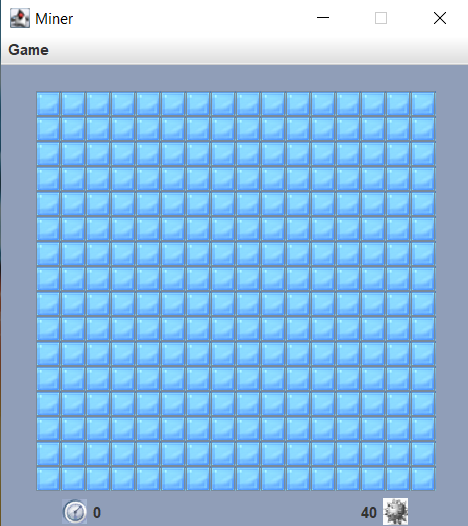
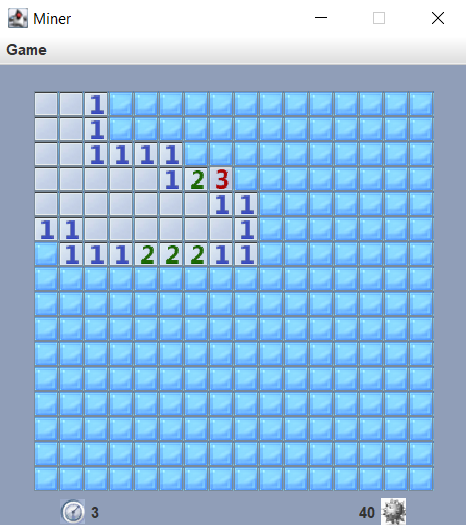
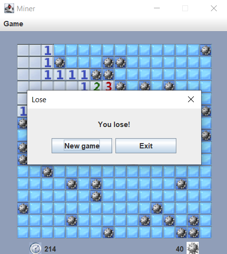

# Minesweeper

[](https://www.oracle.com/java/)
[](https://docs.oracle.com/javase/tutorial/uiswing/)
[](https://en.wikipedia.org/wiki/Model–view–controller)
[](LICENSE)

> A fully functional clone of the classic Windows Minesweeper with precise mechanics, a high-score table, three difficulty levels and MVC architecture.

  


---

## Content
- [Features](#features)
- [Technologies](#technologies)
- [MVC Architecture](#mvc-architecture)
- [How to Run](#how-to-run)

---

## Features

- **Exact original behavior**
    - Left-click to reveal a cell, right-click to place/remove a flag.
    - **First click never hits a mine** – mines are placed after the first move.
    - Flags can be placed even **before** the first click.
    - Automatic flood-fill for empty areas.

- **Advanced mechanics**
    - **Mouse wheel click** on an open number – reveals all neighbours if the correct number of flags is placed around it.
    - Dynamic mine counter: `remaining mines = total mines - flags placed`.

- **Graphics & UI**
    - Custom images for mines, flags, numbers, and cells (loaded via Swing).
    - Responsive layout using `GridLayout` for the game board and `GridBagLayout` for the control panel.

- **Persistence & records**
    - Stopwatch starts **after the first click** on the board.
    - **High-score table** saved between sessions (serialized to `records.json`).
    - Menu with: *New Game*, *High Scores*, *Settings*, *About*, *Exit*.

- **Three standard difficulty levels**
    - Beginner: 9×9, 10 mines
    - Intermediate: 16×16, 40 mines
    - Expert: 16×30, 90 mines

---

## Technologies

- **Java 21+** (Core)
- **Swing (javax.swing)** – GUI framework
- **MVC (Model-View-Controller)** – separates logic, presentation and control
- **Serialization** – for saving high scores

---

## MVC Architecture

The project strictly follows the **Model-View-Controller** pattern:

- **Model** (`GameModel`)
    - Stores the board state: mine locations, flags, revealed cells.
    - Contains pure business logic: reveal cell, check win/loss, place mines after first click.
    - No UI dependency.

- **View** (`GameView`)
    - Renders the game board, mine counter, and timer.
    - Uses `JButton` for each cell.
    - Delegates user input to the Controller.

- **Controller** (`GameController`)
    - Handles mouse events (left, right, wheel).
    - Updates Model and refreshes View.
    - Manages timer, menu actions and high-score logic.

---

## How to Run
### 1. Clone the repository
```bash
git clone https://github.com/Juanoff/minesweeper.git
cd minesweeper
```

### 2. Open in IntelliJ IDEA
File → Open → select the project folder.

Wait for the project to load (no external dependencies).

### 3. Build and run
The easiest way to run the game is directly from your IDE: locate the `Application` class and run it.

Alternatively, run via Gradle:
```bash
./gradlew run
```
